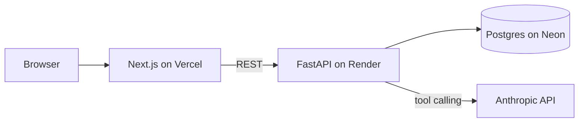

# DateFlow

AI-native task manager with an agent that remembers you.


**Live:** https://dateflow-lake.vercel.app (the API sleeps on the free tier; the first request can take ~30s)

Tell the assistant what you need to do in plain language. It creates, lists and completes tasks through tool calls, asks for a date when you leave it out, and keeps a small, visible memory of your preferences across conversations. Tasks show up in a list and a week view at the same time.

## Features

- Tasks with a title, a date and a done flag. List view and a 7-column week view share one state.
- Chat assistant that turns "call mum on Sunday" into a task, and asks "which date?" when you don't say.
- Every tool call the agent makes is shown under the reply, so you can see what it did.
- Memory: after each exchange a separate model call decides whether anything is worth remembering. Memories are stored, injected into later conversations, and listed on the page where you can delete them.
- Conversation history is persisted, so the chat survives a reload.
- TypeScript types for the API are generated from the FastAPI OpenAPI schema, not written by hand.

## Architecture



- **web/** – Next.js App Router. Server components fetch initial data; client components (`TaskList`, `WeekView`, `Chat`, `Memories`) handle interaction and call the API from the browser.
- **api/** – FastAPI with SQLModel. Routes for tasks, messages, memories and `/chat`. `agent.py` holds the agent loop; `tools.py` holds the tool schemas and their implementations.
- **Postgres** – three tables: `task`, `message`, `memory`. No vector store: memories are short sentences injected into the system prompt.

### How a chat turn works

1. The browser posts the new user text to `/chat`.
2. The API loads the conversation history and all memories from Postgres.
3. The agent loop sends system prompt + memories + history + tool schemas to the model.
4. If the model asks for a tool, the API runs it, appends the result, and calls the model again. This repeats until the model answers in text.
5. The user text and the final reply are saved. A second, separate model call decides whether this exchange contains a new memory, given what is already stored.
6. The reply and the list of tool calls go back to the browser, which refreshes the task list if any tool ran.

## Key decisions

**Hand-written agent loop instead of a framework.** The loop is about 40 lines: call the model, run any requested tools, feed results back, repeat until the model stops asking. Writing it by hand keeps the control flow visible and easy to debug, and it is the part worth being able to explain. Cost: no built-in retries, tracing or token accounting; those would be added before multi-user use.

**Memory extraction as a separate call, not part of the main prompt.** The main agent prompt stays focused on tasks. A second call with its own prompt looks at the last exchange plus existing memories and returns either one new sentence or `NONE`. Passing existing memories to the extractor is what prevents duplicates. Cost: one extra model call per turn.

**One Postgres database for everything.** Tasks, messages and memories are relational data at a scale where a single Postgres instance is the simplest correct choice. If semantic search over memories were ever needed, pgvector would be added to the same database rather than a separate vector store.

**Generated API types.** FastAPI publishes an OpenAPI schema for free. `openapi-typescript` turns it into `web/src/lib/api-types.d.ts`, so a renamed field on the backend becomes a TypeScript error on the frontend instead of a runtime `undefined`. Constraining `role` to `"user" | "assistant"` on the backend is what made the generated union type possible.

**Server components read, client components write.** Initial tasks, messages and memories are fetched on the server and passed down as props; everything interactive runs in the browser. Two API base URLs exist for this reason: the server reaches the API by service name inside Docker, the browser reaches it through the published port.

**Dates are strings.** `YYYY-MM-DD` end to end, compared as strings. No timezone arithmetic on the client; `date-fns` only generates the 7 days of the current week.

## Development

Three terminals:

```bash
# 1. database (once; stays up in the background)
docker compose up -d db

# 2. API
cd api && source .venv/bin/activate && fastapi dev main.py

# 3. web
cd web && npm run dev
```

Open http://localhost:3000. API docs at http://localhost:8000/docs.

`api/.env` needs `ANTHROPIC_API_KEY`. `DATABASE_URL` defaults to the local compose database.

### Checks

The same checks CI runs:

```bash
cd api && ruff check . && python -c "import main"
cd web && npx tsc --noEmit && npm run lint
```

### Regenerate API types

After changing a model or route in `api/`, with the API running:

```bash
cd web && npm run gen:api
```

## Run the whole stack with Docker

```bash
docker compose up -d --build
```

## Deployment

- **web** → Vercel, root directory `web`, env `API_URL` and `NEXT_PUBLIC_API_URL` pointing at the API.
- **api** → Render web service from `api/Dockerfile`, env `ANTHROPIC_API_KEY` and `DATABASE_URL` (`postgresql+psycopg://...`).
- **db** → Neon Postgres.

Pushing to `main` redeploys both services.

## Limitations and next steps

- Single user, no authentication.
- Replies are not streamed yet; the UI shows "thinking…" until the whole turn finishes.
- Tables are created with `create_all` on startup; a migration tool (Alembic) is the next step before changing schemas in production.
- The same SQLModel class serves as input and output; splitting `TaskRead` from `Task` would make `id` and `created_at` required in the generated types without the current `Saved<T>` helper.
- Week view cells truncate long titles.

## License

MIT
